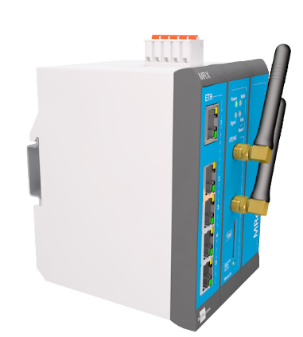
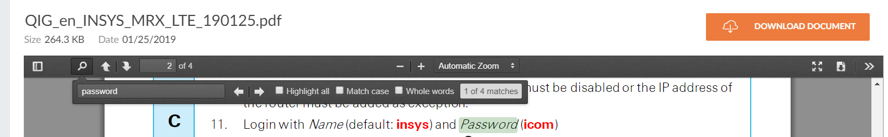

# Acess the Device!

## Points: 200

## Description
> I found this device in the control cabinet, seems to be interesting. Can you please help me find out the default username and password?

## Writeup
Based on the task image, we can see either the company or model name of the device "MRX".

A [Google search]((https://www.google.com/search?q=mrx+ics&rlz=1C1GGRV_enUS749US749&oq=mrx+ics&aqs=chrome..69i57.999j0j1&sourceid=chrome&ie=UTF-8)) for the phraes "MRX ICS" gives us the device overview from the manufacturer: https://256.insys-icom.com/MRX

The [user manual](https://public.centerdevice.de/2fbc5e37-0535-46cf-b78b-486f5603ff63) tells us the default login information:

## Flag: `{insys:icom}`