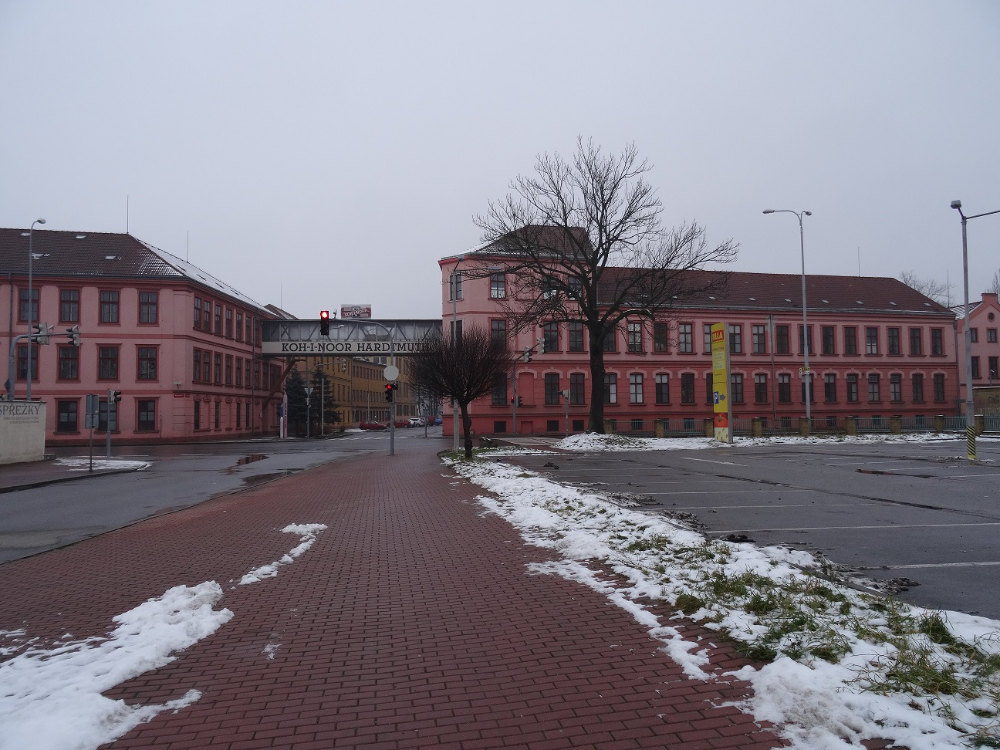
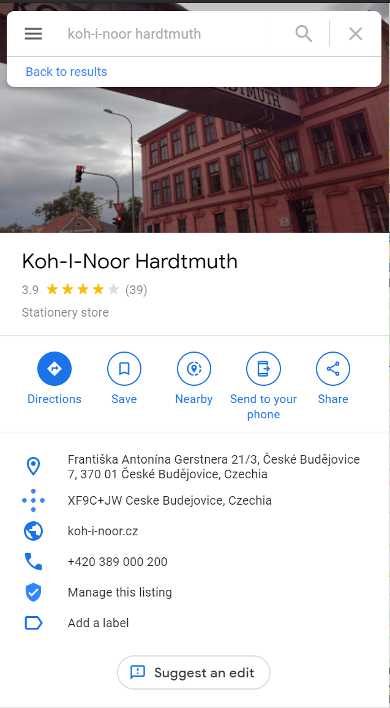

# Industrial Sightseeing tour 1

### Points: 100

### Description
>My friend loves factories. But she didn't tell me the location (city) of this building. Can you help me?

## Writeup
By zooming in on the image, you can make out some letters on the bridge between the buildings, which reads "Koh-I-Noor Hardtmuth".

Throwing this into Google, we learn that this is the name of a stationary store in Czechia (https://www.google.com/maps/search/koh-i-noor+hardtmuth/@48.9618108,14.472051,8z/data=!3m1!4b1)

After scrolling through some of the locations, the building from the original picture appears (https://www.google.com/maps/place/Koh-I-Noor+Hardtmuth/@48.9618108,14.472051,8z/data=!4m8!1m2!2m1!1skoh-i-noor+hardtmuth!3m4!1s0x47734fc45ce13eb1:0xf4344a12bcb62234!8m2!3d48.9690575!4d14.4722549)

### Flag: `{Ceske-Budejovice}`