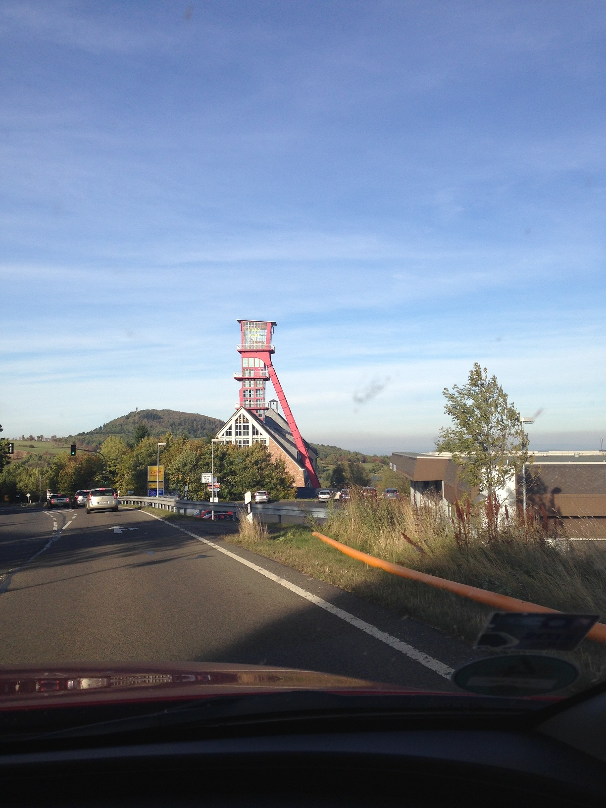
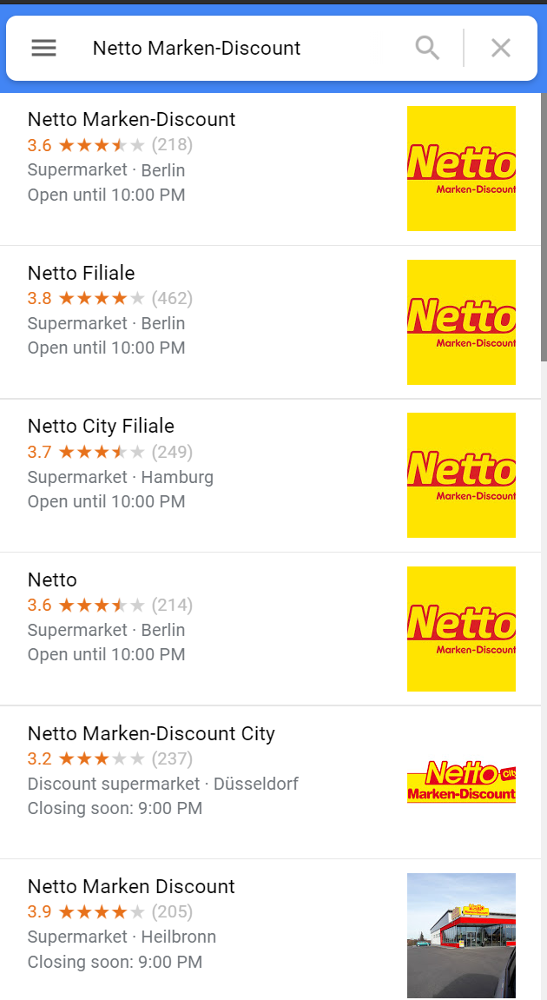

# Industrial Sightseeing Tour 2

### Points: 200

### Description
> She sent me another picture. Can you tell me the name of the tower on top of the red industrial building?

## Writeup
In this image, there are a few details that can help us figure out where this is:
* We see "EURO PARK" on the side of the red tower
* We can partially make out the first few letters of the sign down the road.

Based on the license plate dimensions (and "EURO PARK" from the tower) we can assume this is somewhere in Europe. An intial Google search for "EURO PARK" didn't seem to return any useful results other than an amusement park in Germany. After trying a few possible letter combines from the yellow sign, we learn that it reads "Netto", which is a supermarket chain in Germany.

While focused on Germany, running another Maps search for "Europark" gives us a result in Altenberg, which is next to a Netto location: https://www.google.com/maps/place/Europark,+01773+Altenberg,+Germany/@50.7596149,13.7628176,16z/data=!3m1!4b1!4m5!3m4!1s0x4709933ee18d9193:0xe303d095bfb7dc21!8m2!3d50.7590168!4d13.7674151

From the maps view, we see the tower's name and the flag (Arno-Lippmann-Schact): https://www.google.com/maps/place/Arno-Lippmann-Schacht/@50.7589027,13.7649306,415m/data=!3m1!1e3!4m13!1m7!3m6!1s0x4709933ee18d9193:0xe303d095bfb7dc21!2sEuropark,+01773+Altenberg,+Germany!3b1!8m2!3d50.7590168!4d13.7674151!3m4!1s0x4709933edaea1289:0x2413ff66dc6fd5c6!8m2!3d50.7593421!4d13.765505

### Flag: `{Arno-Lippmann-Schact}`