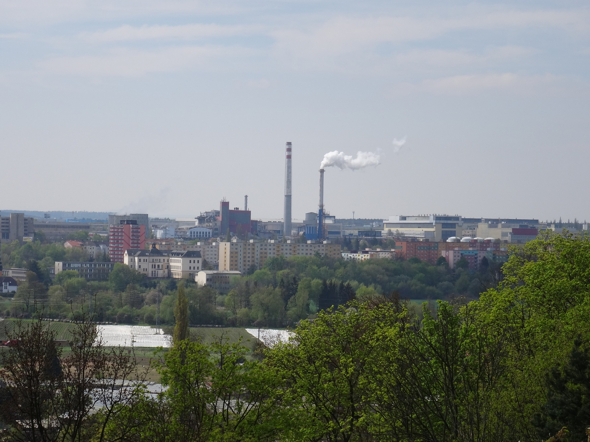
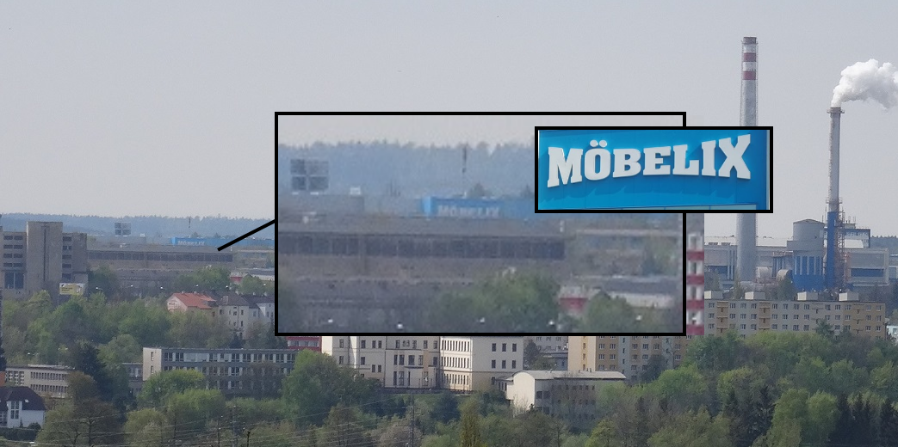
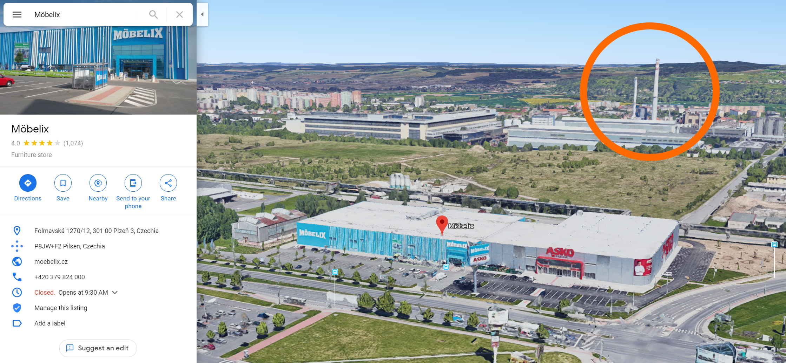
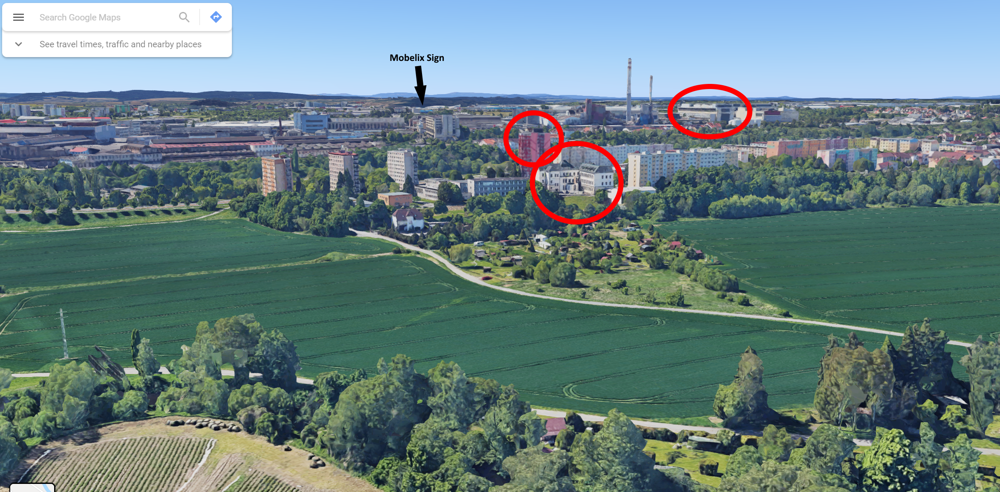

# Industrial Sightseeing tour 3

## Points: 500

## Description
> Ah, there is the last picture. What is the name of the company that owns these nice chimneys?

## Writeup
Zooming in on the image we can just barely make out a sign on the left side of the image, which reads "Mobelix":

A Google search reveals Mobelix is a furniture store in Czechia. In Maps, there are a decent number of locations returned. To help narrow down the search, we can rule out certain locations since Mobelix appears to alternate between a Yellow and Blue color scheme for their stores. Luckily, a location on the second page of results appears to be the winner.

Using 3D mode, we can see chimneys to the north of the store referenced in the task image:

We can also confirm this is the location by attempting to recreate the original image with Maps (note the residential buildings):

Maps tells us that the chimneys belong to a company called "Energetika": https://www.google.com/maps/place/Plze%C5%88sk%C3%A1+tepl%C3%A1rensk%C3%A1,+a.s.+-+Energetika/@49.7433283,13.3462523,374a,35y,181.54h,51.46t/data=!3m1!1e3!4m12!1m6!3m5!1s0x470aedfb34cf4d4d:0xfa03398f385ce5a8!2zTcO2YmVsaXg!8m2!3d49.7311356!4d13.3450184!3m4!1s0x470af1f8aac2f005:0x3667fe49435b018e!8m2!3d49.7391176!4d13.3462637

## Flag: `{Energetika}`
