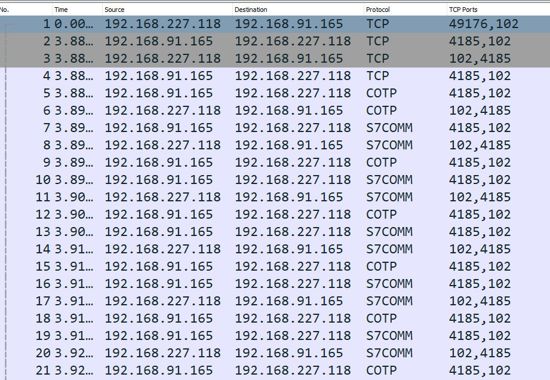
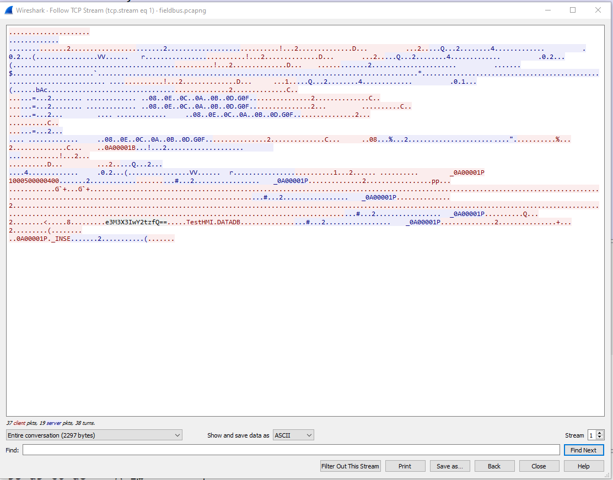
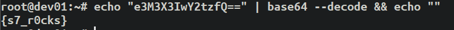

# Packets Are Wonderful

## Points: 500

## Description
>All the PLCs programs have a high information value. I just have to get it.

## Writeup
For this task, we're given a `.pcapng` file to analyze. We can see that there are a couple interesting protocols being used here:

Using Wireshark's `Anaylze -> Follow TCP Stream` functionality, we see something interesting within the S7COMM protocol stream:

There seems to be a Base64 encoded string here: `e3M3X3IwY2tzfQ==`

Decoding this string gives us our flag:

## Flag: `{s7_r0cks}`