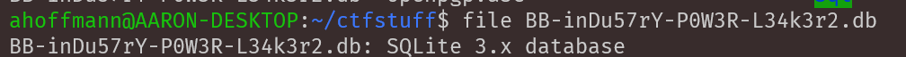
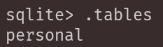
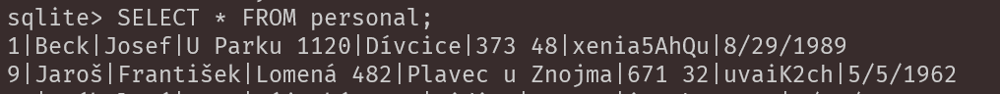
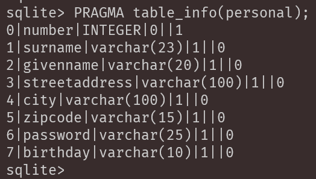
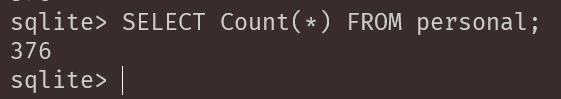
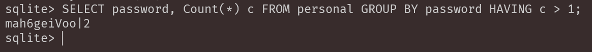
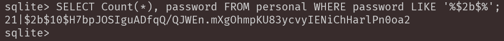

# Leak Audit

### Points: 200
### Label: sql
# Description 
We found an old dump of our employee database on the dark net! Please check the database and send us the requested information:

1. How many employee records are in the file?

2. Are there any employees that use the same password? (If true, send us the password for further investigation.)

3. In 2017, we switched to bcrypt to securely store the passwords. How many records are protected with bcrypt?

## Writeup
A tar file containing a SQLite database is provided:

There's only 1 table "personal", and it looks to contain user information, including passwords:

For the first question, the following query is run to get the total number of rows, which returns 376:

`SELECT Count(*) FROM personal;`

For the second question, the following query is run to return any duplicate password values:

`SELECT password, Count(*) c FROM personal GROUP BY password HAVING c > 1;`

The query to return the total number of passwords hashed with bcrypt for the final question is:

`SELECT Count(*), password FROM personal WHERE password LIKE '%$2b$%';`

### Flag: `syskronCTF{376_mah6geiVoo_21}`