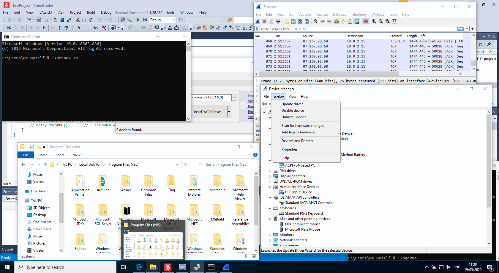
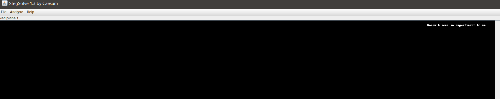
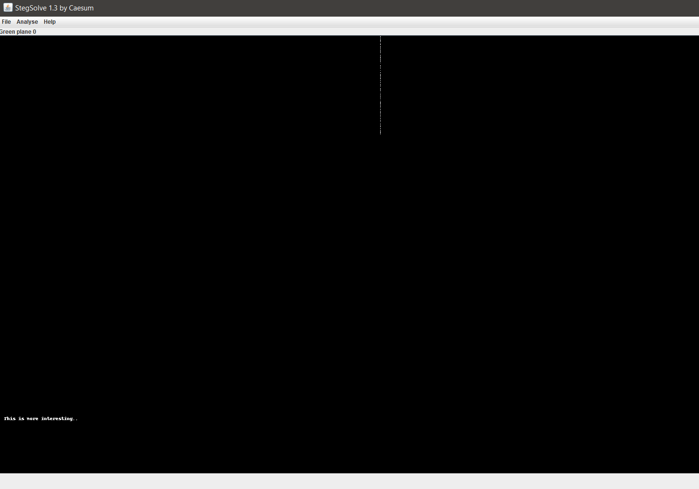
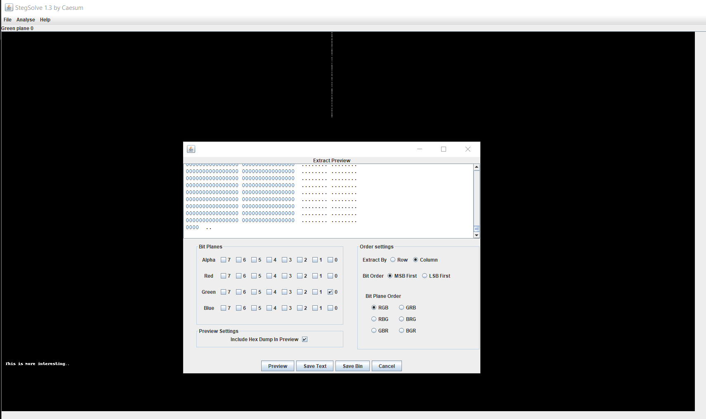
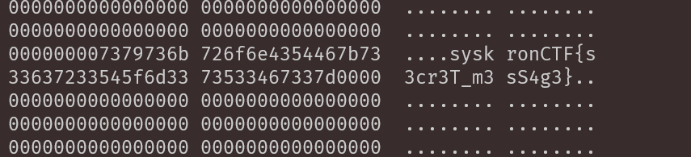

# Screenshot

### Points: 300
### Label: image-analysis
# Description 
After a hacking attack, we have fetched some suspicious e-mails sent from within Senork Vertriebs GmbH to an unknown recipient. It has an attachment and says, "Hi, I managed to capture a screenshot. I am sure there is something useful for us in there, even if it's not that significant. Good luck".
What could that be?

## Writeup
The following image is provided:

Nothing in the image content itself was interesting. Opening the image in StegSolve, we can see that there are a few interesting bits on certain planes:

Based on the clues provided, this is probably least significant bit steganography.

In the second image above representing the Green plane 0, there's a vertical line of pixels, which is probably where our flag is.

In StegSolve's Data Extract feature, setting the bit plane mentioned above and copying the data out to a text editor reveals the flag:

### Flag: `syskronCTF{s3cr3T_m3sS4g3}`