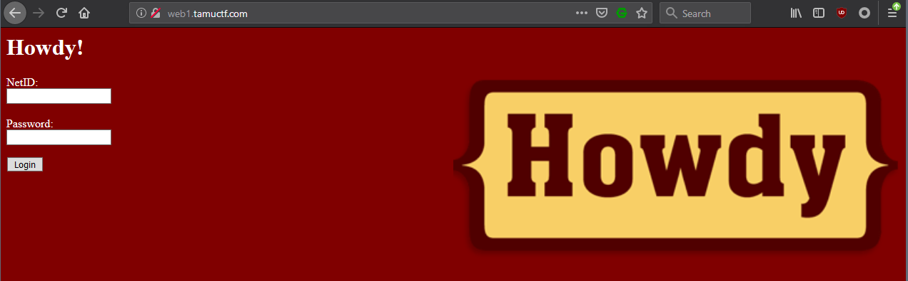

# Not Another SQLi Challenge

## Points: 100

Similar to last years challenge, a simple SQL injection will give you the flag. 

In this scenario, the password parameter is vulnerable. Supply the following credentials:

* User: `admin`
* Password: `' or 1=1;-- -`

And you'll get the flag:

`gigem{f4rm3r5_f4rm3r5_w3'r3_4ll_r16h7}!`