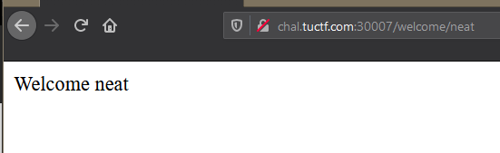

# And Now, For Something Completely Different

### Points: 497

### Description
> We all know Black Friday is the time for shopping. Can you find us a flag on this online store?

# Writeup

Opening the challenge in the browser returns a simple ecommerce store:

Trying to exploit the authentication mechanism didn't seem to go anywhere, so I opened the web console to check for any hints. At the bottom, there's a TODO comment that mentions an interesting page "/welcome/test":

Opening this page reveals some text, "Welcome test". 

Since the word "test" is in the URL, it is likely a parameter being used as input. I changed test to "neat" to confirm this:

Since we have control over this parameter, I start looking for ways to exploit this. In the response headers, the server attribute says the host is running TornadoServer v4.5.2. 

A search for vulnerabilities related to this version of TornadoServer returns a nice [blog post written by OpSecX](https://opsecx.com/index.php/2016/07/03/server-side-template-injection-in-tornado/) about how Server Side Template Injection can be achieved. Following the walkthrough, I tested some basic arithmetic to see if I can run arbitrary code:

Knowing that this host is indeed vulnerable to SSTI, I browse the file system which reveals the flag:

Full URL with exploit: 
`http://chal.tuctf.com:30007/welcome/%7B%import%20os%%7D%7B%7Bos.popen(%22cat%20flag.txt%22).read()%7D%7D`

### Flag: `TUCTF{4lw4y5_60_5h0pp1n6_f0r_fl465} `