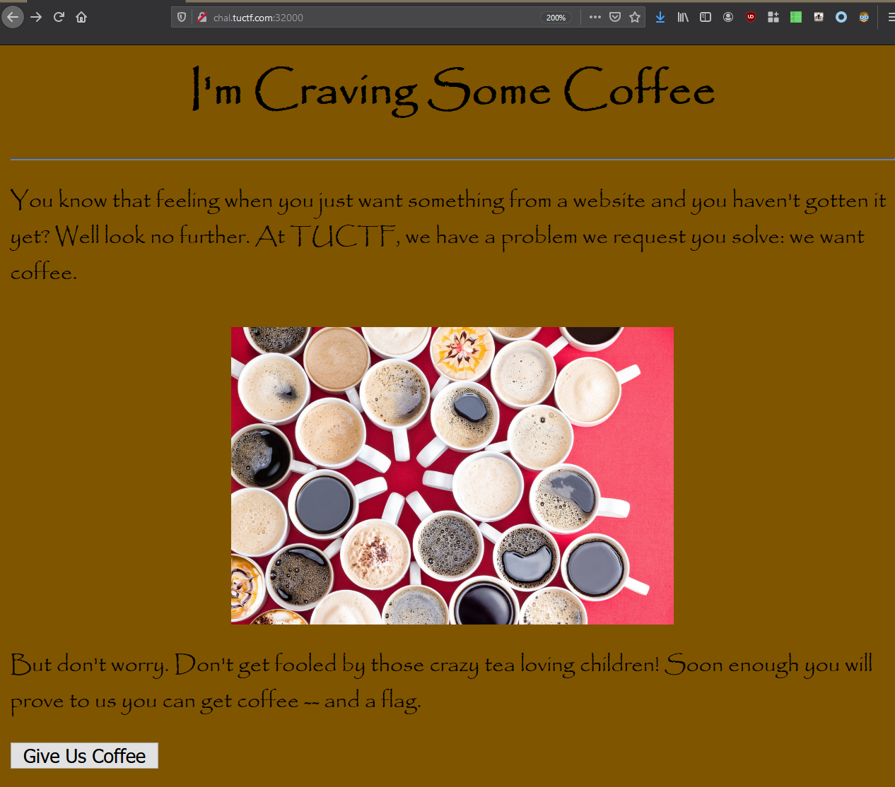
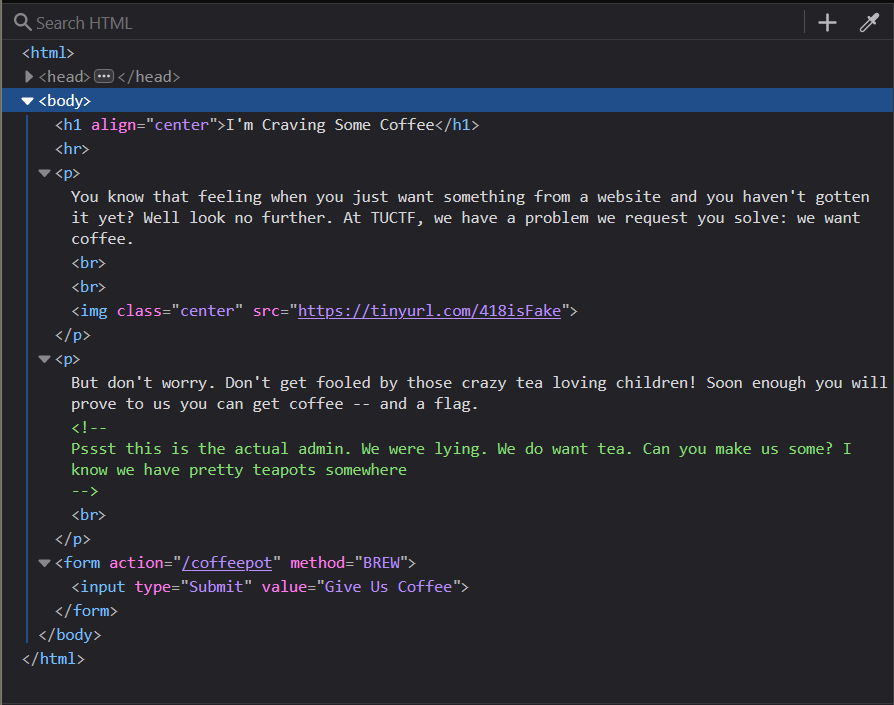
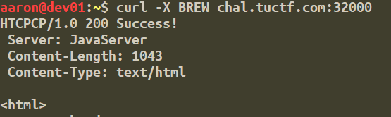
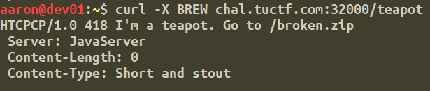
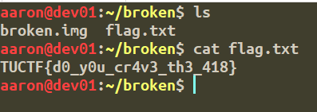

# Cup of Joe: The Server

### Points: 100

### Description
> On the first leg of the journey, I was looking at all the life, there were plants and hills and rocks and things, there was java and mugs and caffeine.

# Writeup
Opening the challenge link in a browser returns a simple-looking site:

Clicking the "Give Us Coffee" button prompts a download of some junk data. Opening up the Inspector reveals some potentially useful information:

The interesting part here is in the form at the bottom. The request method is set to "BREW", which doesn't seem like a valid request method. Doing some research shows that this is actually a valid method for the [Hyper Text Coffee Pot Control Protocol (HTCPCP)](https://en.wikipedia.org/wiki/Hyper_Text_Coffee_Pot_Control_Protocol), which was originally published as [RFC 2324](https://tools.ietf.org/html/rfc2324) for an April Fools' prank in 1998! 

Sending a simple curl request with the method set to "BREW" confirms this:

While this is neat, none of the coffee-related methods return a flag. In a comment in one of the previous screenshots, an admin mentions that they actually want some tea, not coffee. So rather than sending a BREW request to /coffeepot, I instead send a BREW request to /teapot:

Using wget to download the ZIP file and unzipping the contents reveals an image file and the flag:

### Flag: TUCTF{d0_y0u_cr4v3_th3_418}